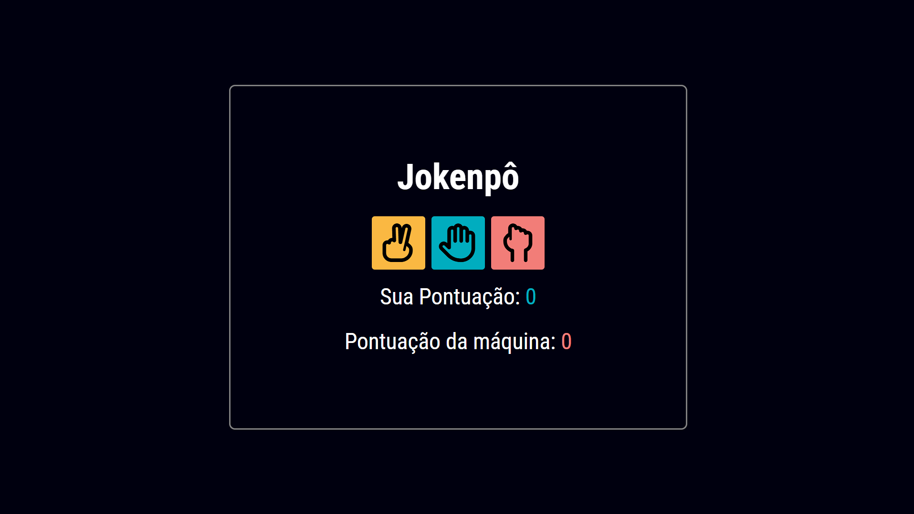

# Jokenpô Game

 

Esse é um projeto de um jogo de jokenpô, que foi criado utilizando HTML, CSS e JS. Onde o objetivo do game é alcançar a pontuação de 15 pontos antes ds máquina. **[Link do Projeto](https://davirrocha.github.io/jokenpo/)**

## Funcionalidades

- Escolha entre Pedra, Papel ou Tesoura.

- Pontuação do jogador e da máquina exibida em tempo real.

- Indicação visual de empate, vitória ou derrota de cada rodada.

- Mensagem de vitória ou derrota ao final do jogo.

- Botão para reiniciar o jogo.

## Tecnologias Utilizadas

- HTML5: Para a estruturação do projeto.

- CSS3: Para estilização da interface.

- JavaScript: Para a lógica do jogo e interatividade.

 
